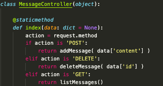

# Protótipo de MVC
Protótipo para exemplificar a arquitetura MVC e a utilização do padrão de design Facade

### Arquitetura MVC

MVC é uma arquitetura para desenvolvimento web que consiste na separação das responsabilidades do sistema em 3 principais pelares: model, view, controller

#### Model
Responsável pela representação abstrata dos modelos de dados da aplicação

#### View
Responsável pela entrega dos resultados para o usuário

#### Controller
É A ponte entre os models e as views. Responsável pela regra de negócio do sistema, implementa as lógicas que seram utilizadas nós dados e entregue para as views

--------------------
### Facade

Facade é um padrão de design estrutural utilizado em sistemas complexos como uma conexão intermediária entre sistemas. Apresenta a função de distribuir o fluxo para subsistemas, podendo ser uma classe que representa um sistema ou outro sistema que é integrado ao sistema principal.

Neste projeto ele é utilizado para distribuição das funcões de manipulação das mensagens (criação, exclusão e listagem). O sistema recebe um único fluxo de requisição e o distribui para o método correspondente através da análise do tipo de requisição.

Essa é a classe responsável pela implementação do padrão de design Facade:

--------------------
### Descrição do projeto

O seguinte projeto utiliza-se dessa arquitetura para implementar um sistema web de registro de mensagens, podendo incluir, excluir e listar as mensagens. As páginas estão disponíveis na pasta [view](VIEW_URL), o acesso e tratamento de dados estão codificados nos [controllers](CONTROLLER_URL), e abstração do modelo de dado está representada no [model](MODEl_URL).

