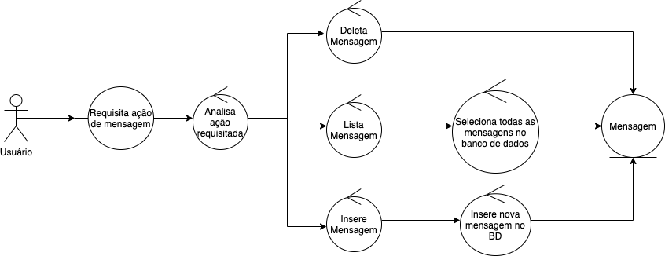
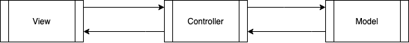

# Protótipo de MVC
Protótipo para exemplificar a arquitetura MVC e a utilização do padrão de design Facade

--------------------
### Arquitetura MVC
MVC é uma arquitetura para desenvolvimento web que consiste na separação das responsabilidades do sistema em 3 principais pilares: model, view, controller

#### Model
Responsável pela representação abstrata dos modelos de dados da aplicação

#### View
Responsável pela entrega dos resultados para o usuário

#### Controller
Ponte entre os models e as views. Responsável pela regra de negócio do sistema, implementa as lógicas que seram utilizadas nós dados e entregue para as views

--------------------
### Facade

Facade é um padrão de design estrutural utilizado em sistemas complexos, algo como uma conexão intermediária entre subsistemas. Apresenta a função de distribuir o fluxo entre estes subsistemas, podendo ser uma interno em um único sistema ou outro sistema distinto que é integrado ao sistema principal.

Neste projeto ele é utilizado para distribuição das funcões de manipulação das mensagens (criação, exclusão e listagem). O sistema recebe um único fluxo de requisição e o distribui para o método correspondente através da análise do tipo de requisição.

A classe abaixo é responsável pela implementação do padrão de design Facade:

--------------------
### Descrição do projeto

Esse projeto utiliza-se da arquitetura MVC para implementar um sistema web de registro de mensagens, podendo incluir, excluir e listar as mensagens. As páginas estão disponíveis na pasta [views](app/views), o acesso e tratamento de dados estão codificados nos [controllers](app/controllers), e abstração do(s) modelo(s) de dado está representada em [models](app/models).

--------------------
### Diagrama de Robustes

--------------------
### Diagrama de Colaboração

--------------------
### Fontes
- https://plleon.wordpress.com/2008/10/24/diagrama-de-robustez/
- https://refactoring.guru/design-patterns/facade
- https://refactoring.guru/design-patterns/facade/python/example#example-0
- https://sourcemaking.com/design_patterns
- https://plleon.wordpress.com/
